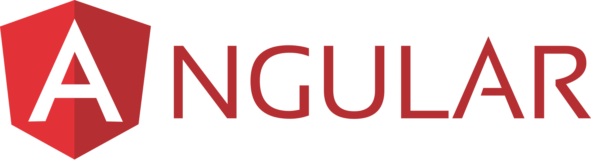
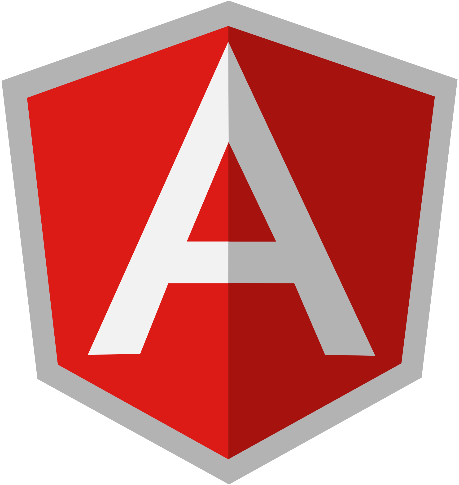

<h3 align="center">
    
</hr>

# 📑 Índice
- [Sobre](#-sobre)
- [Tecnologias Utilizadas](#-tecnologia-utilizadas)
- [Como baixar o projeto](#-como-baixar-o-projeto)

---
##  Sobre
O projeto **angular** foi desenvolvido com o objetivo de apreender e aperfeiçoar o conhecimento sobre a ferramenta Angular.

A fim de obter exemplos de usos foi utilizado o curso gratuito de Angular oferecido pela [Loaine Groner](https://loiane.training/) como base desse projeto.

---

## 🛠 Tecnologia Utilizadas

 - [Nodejs](https://nodejs.org/)
 - [Typescript](https://www.typescriptlang.org/)
 - [Angular](https://angular.io/)

---

## 📁 Como baixar o projeto

```bash
# Clonar o repositorio
$ git clone https://github.com/JeanEdiel/angular

# Acessar o diretório
$ cd angular

# Instalar as dependências
$ yarn install

# Iniciar o projeto
$ ng serve
```

---

Desenvolvido por Jean Mello
